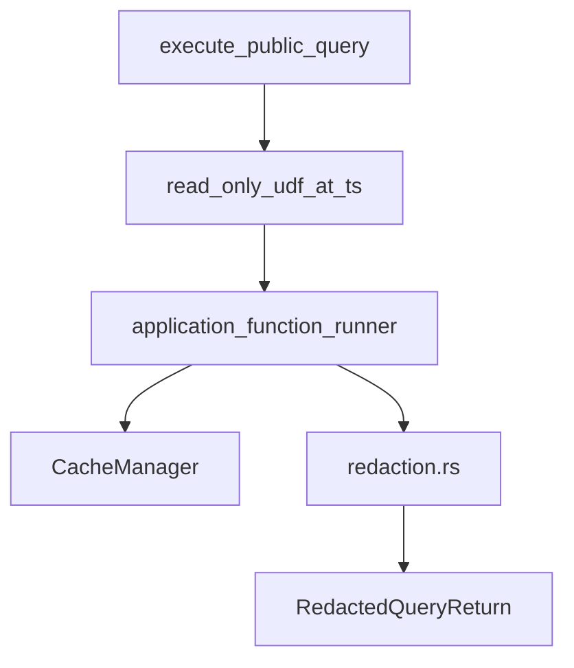

# application

The **`Application<RT>`** type — central orchestrator. Receives query requests from sync/HTTP, handles caching, auth, and dispatches to function_runner. Wraps results in redacted responses.

## Role in query flow

## Key files

| File | Role |
|------|------|
| <CrateRef crate="application" file="api.rs" path="crates/application/src/api.rs" line="98" /> | `execute_public_query` — thin API trait impl |
| <CrateRef crate="application" file="lib.rs" path="crates/application/src/lib.rs" line="1093" /> | `read_only_udf_at_ts` — query dispatch + redaction |
| <CrateRef crate="application" file="lib.rs" path="crates/application/src/lib.rs" line="3002" /> | `authenticate` — JWT validation orchestration |
| <CrateRef crate="application" file="mod.rs" path="crates/application/src/application_function_runner/mod.rs" line="1827" /> | `run_query_at_ts` — cache check, calls function_runner |
| <CrateRef crate="application" file="redaction.rs" path="crates/application/src/redaction.rs" /> | Strips internal log lines before client return |

## Notes

### `execute_public_query()` {#execute-public-query}

<CrateRef crate="application" file="api.rs" path="crates/application/src/api.rs" line="98" /> — entry from sync worker. Delegates to `read_only_udf_at_ts`.

Receives `ExportPath` (e.g. `pets:listMine`), `Identity`, args, timestamp, optional query journal.

### `read_only_udf_at_ts()` {#read-only-udf}

<CrateRef crate="application" file="lib.rs" path="crates/application/src/lib.rs" line="1093" /> — the real query dispatch. Calls `application_function_runner::run_query_at_ts`.

Lots of interesting stuff in `lib.rs` — worth browsing when stepping.

### `authenticate()` {#authenticate}

<CrateRef crate="application" file="lib.rs" path="crates/application/src/lib.rs" line="3002" /> — loads auth config from `_auth` ([model](/crates/model)), calls [authentication](/crates/authentication) `validate_id_token`.

### Caching {#caching}

<CrateRef crate="application" file="mod.rs" path="crates/application/src/application_function_runner/mod.rs" line="1827" /> — may return cached `UdfOutcome` if reads haven't changed. Open question: when exactly does sync re-run vs hit cache?

### Redaction {#redaction}

<CrateRef crate="application" file="redaction.rs" path="crates/application/src/redaction.rs" /> — redacts log lines the client shouldn't see. Worth reading: is there interesting internal state in logs?

## Debug tips

- Thin stack at `api.rs:98` — step into `read_only_udf_at_ts` quickly
- Watch `PublicFunctionPath` and `ExportPath` conversion ([common](/crates/common))
- Break on redaction to see what's stripped from query results

## Related

- [sync](/crates/sync)
- [function_runner](/crates/function_runner)
- [Query entry](/flows/query-entry)
