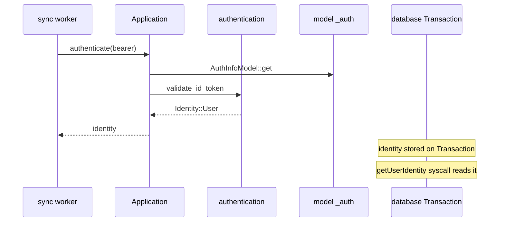

# authentication

**JWT/OIDC validation** — turns `Authorization: Bearer` tokens into `keybroker::Identity` that flows through queries and database transactions.

## Role in query flow

For `pets.listMine`: signed-in user → `optionalUser` → `getAuthUserId` → non-empty `ownerUserId` filter. Unsigned → returns `[]`.

## Key files

| File | Role |
|------|------|
| <CrateRef crate="authentication" file="lib.rs" path="crates/authentication/src/lib.rs" line="106" /> | `extract_bearer_token` |
| <CrateRef crate="authentication" file="lib.rs" path="crates/authentication/src/lib.rs" line="139" /> | `validate_id_token` — core JWT validation |
| <CrateRef crate="authentication" file="application_auth.rs" path="crates/authentication/src/application_auth.rs" /> | Admin/deploy key checks (not normal user queries) |
| <CrateRef crate="application" file="lib.rs" path="crates/application/src/lib.rs" line="3002" /> | `Application::authenticate` — orchestrates validation |

## Notes

### Bearer → Identity {#bearer-identity}

1. [sync](/crates/sync) <CrateRef crate="sync" file="worker.rs" path="crates/sync/src/worker.rs" line="786" /> `fetch_identity` on WebSocket connect
2. <CrateRef crate="application" file="lib.rs" path="crates/application/src/lib.rs" line="3002" /> loads provider config from `_auth` table
3. <CrateRef crate="authentication" file="lib.rs" path="crates/authentication/src/lib.rs" line="139" /> validates JWT signature, expiry, audience
4. Returns `Identity::User { ... }` passed to `execute_public_query`

### Auth config source {#auth-config}

Provider URLs, JWKS, etc. live in `_auth` system table — managed by [model](/crates/model) `AuthInfoModel`.

lbbb uses `@convex-dev/auth` — JWT subject maps to `users` table doc ID.

### Open question {#ctx-auth}

How exactly does `Identity::User` on the Rust transaction become `ctx.auth.getUserIdentity()` in JS?

Path: transaction identity → `getUserIdentity` syscall → [isolate async_syscall](/crates/isolate#syscalls). Requires `observe_identity()` in handler path.

## Debug tips

- Break `validate_id_token` to inspect JWT claims
- Compare admin key path (`ApplicationAuth`) vs user JWT path
- If `listMine` returns `[]`, check identity is present before query runs

## Related

- [sync](/crates/sync)
- [application](/crates/application)
- [model](/crates/model)
