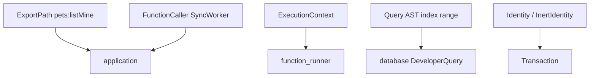

# common

**Shared types and utilities** — glue between sync, application, database, isolate, and udf. If two crates both reference a type, it probably lives here.

## Role in query flow

## Key files

| File | Role |
|------|------|
| <CrateRef crate="common" file="function_paths.rs" path="crates/common/src/components/function_paths.rs" line="137" /> | `ExportPath` — client path `pets:listMine` |
| <CrateRef crate="common" file="query.rs" path="crates/common/src/query.rs" /> | `Query`, `IndexRange`, `Order` — deserializes db.query AST |
| <CrateRef crate="common" file="execution_context.rs" path="crates/common/src/execution_context.rs" line="133" /> | `ExecutionContext` — request/execution IDs for logging |
| <CrateRef crate="common" file="identity.rs" path="crates/common/src/identity.rs" /> | `InertIdentity` — safe identity snapshot in outcomes |
| <CrateRef crate="common" file="auth.rs" path="crates/common/src/auth.rs" /> | `AuthInfo` — provider config type |
| <CrateRef crate="common" file="mod.rs" path="crates/common/src/runtime/mod.rs" line="280" /> | `Runtime` trait — abstract OS/Tokio (see [runtime](/crates/runtime)) |

## Notes

### `ExportPath` {#export-path}

<CrateRef crate="common" file="function_paths.rs" path="crates/common/src/components/function_paths.rs" line="137" /> — sync passes `ExportPath::from(query.udf_path.canonicalize())` to `execute_public_query`.

String form: `pets:listMine` (module `pets`, export `listMine`).

### Query AST {#query-ast}

<CrateRef crate="common" file="query.rs" path="crates/common/src/query.rs" /> — when JS calls `ctx.db.query('pets').withIndex('by_owner', ...)`, the isolate serializes this AST for the `queryPage` syscall. Database interprets it as `DeveloperQuery`.

### `ExecutionContext` {#execution-context}

<CrateRef crate="common" file="execution_context.rs" path="crates/common/src/execution_context.rs" line="133" /> — tags each UDF run with IDs for tracing/logs.

### `FunctionCaller` {#function-caller}

Enum indicating who invoked the UDF — `SyncWorker`, HTTP API, etc. Affects logging and some permission paths.

## Debug tips

- Log `ExportPath` at sync worker to confirm correct function name
- `Query` struct is the bridge between JS db API and Rust index scans
- Heavy crate — grep here when you see a type used across multiple crates

## Related

- [sync](/crates/sync)
- [application](/crates/application)
- [runtime](/crates/runtime)
