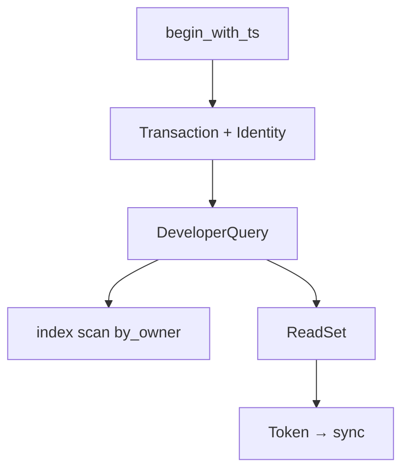

# database

**Transactional storage engine.** Snapshots, indexes, read/write tracking. Every `ctx.db` call from V8 ultimately hits `DeveloperQuery` here.

Also produces **reactive tokens** — the read-set that tells sync when to invalidate subscriptions.

## Role in query flow

For `pets.listMine`: one `DeveloperQuery` on `pets/by_owner`, plus N+1 queries per pet for blogs/posts/assets.

## Key files

| File | Role |
|------|------|
| <CrateRef crate="database" file="database.rs" path="crates/database/src/database.rs" line="1766" /> | `begin_with_ts` — read txn at subscription timestamp |
| <CrateRef crate="database" file="transaction.rs" path="crates/database/src/transaction.rs" /> | `Transaction` — carries Identity, tracks reads/writes |
| <CrateRef crate="database" file="mod.rs" path="crates/database/src/query/mod.rs" line="139" /> | `DeveloperQuery` — executes index/table scans |
| <CrateRef crate="database" file="reads.rs" path="crates/database/src/reads.rs" /> | `ReadSet` — records every doc/index touched |
| <CrateRef crate="database" file="token.rs" path="crates/database/src/token.rs" line="17" /> | `Token` — serialized read-set for sync |

## Notes

### `begin_with_ts()` {#begin-with-ts}

<CrateRef crate="database" file="database.rs" path="crates/database/src/database.rs" line="1766" /> — function_runner opens a read transaction at the query timestamp with the caller's `Identity`.

Repeatable reads: query sees a consistent snapshot.

### `DeveloperQuery` {#developer-query}

<CrateRef crate="database" file="mod.rs" path="crates/database/src/query/mod.rs" line="139" /> — backs syscall `1.0/queryPage`.

For `listMine`:
1. `query('pets').withIndex('by_owner', q => q.eq('ownerUserId', user._id))`
2. Index range scan via schema from [model](/crates/model) `_schemas`
3. Each `.collect()` paginates through `DeveloperQuery::next`

### ReadSet + Token {#readset-token}

<CrateRef crate="database" file="reads.rs" path="crates/database/src/reads.rs" /> — every document and index range read is recorded.

<CrateRef crate="database" file="token.rs" path="crates/database/src/token.rs" line="17" /> — packed read-set returned to [sync](/crates/sync). When a write touches anything in the set, subscription invalidates.

### Identity on transaction {#identity}

<CrateRef crate="database" file="transaction.rs" path="crates/database/src/transaction.rs" /> — `user_identity()` is what `getUserIdentity` syscall returns to JS after `observe_identity()`.

## Debug tips

- Break `DeveloperQuery::next` to watch individual doc reads
- Log `ReadSet` size for N+1 queries like `listMine`
- SQLite file: `convex_local_data.sqlite3` (local dev)

## Related

- [isolate syscalls](/crates/isolate#syscalls)
- [model](/crates/model) — schema defines indexes
- [value](/crates/value) — document encoding
