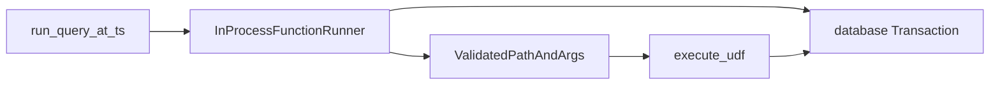

# function_runner

Bridges **Application** to **IsolateClient**. Opens a database transaction, validates the UDF path, and runs the query in V8.

## Role in query flow

## Key files

| File | Role |
|------|------|
| <CrateRef crate="function_runner" file="lib.rs" path="crates/function_runner/src/lib.rs" line="85" /> | `FunctionRunner` trait — `run_function` |
| <CrateRef crate="function_runner" file="server.rs" path="crates/function_runner/src/server.rs" line="277" /> | `run_function_no_retention_check` — core dispatch |
| <CrateRef crate="function_runner" file="in_process_function_runner.rs" path="crates/function_runner/src/in_process_function_runner.rs" line="209" /> | Trait impl — wraps server, pause points for tests |
| <CrateRef crate="function_runner" file="server.rs" path="crates/function_runner/src/server.rs" /> | `InProcessFunctionRunner::new` — creates IsolateClient |

## Notes

### `run_function()` {#run-function}

<CrateRef crate="function_runner" file="in_process_function_runner.rs" path="crates/function_runner/src/in_process_function_runner.rs" line="209" /> — Application calls this for every query/mutation/action.

For queries: opens read transaction at timestamp, validates path via [udf](/crates/udf), calls `IsolateClient::execute_udf`.

### Instantiation {#instantiation}

Created in `make_app()` — see [function runner notes](/execution/function-runner). Creates `IsolateClient`, module cache, index cache.

### Analyze {#analyze}

Module analysis (finding exports, routes, crons) uses <CrateRef crate="isolate" file="analyze.rs" path="crates/isolate/src/environment/analyze.rs" /> — separate from query execution but same isolate infrastructure.

## Debug tips

- Break on `run_function` to catch all UDF types (query vs mutation vs action)
- `pause_client.wait("run_function")` — test hook, useful grep target
- Transaction is passed into isolate — identity lives on it ([database](/crates/database))

## Related

- [application](/crates/application)
- [isolate](/crates/isolate)
- [udf](/crates/udf)
