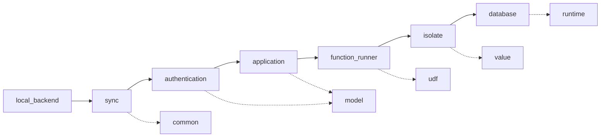

# Crates

Top **12 crates** for tracing a query like `pets.listMine` from browser → backend → V8 → database → back. Ordered by where they appear in the flow.

Click any pill's **crate half** for notes, **file half** to open in Cursor.

## Query flow (the dozen)

## Core dozen

| # | Crate | Role in `pets.listMine` |
|---|-------|-------------------------|
| 1 | <CrateRef crate="local_backend" file="lib.rs" path="crates/local_backend/src/lib.rs" /> | Boots server, creates Application, mounts sync worker |
| 2 | <CrateRef crate="sync" file="worker.rs" path="crates/sync/src/worker.rs" /> | WebSocket subscription; calls `execute_public_query` on refresh |
| 3 | <CrateRef crate="authentication" file="lib.rs" path="crates/authentication/src/lib.rs" /> | Validates JWT → `Identity::User` before query runs |
| 4 | <CrateRef crate="application" file="api.rs" path="crates/application/src/api.rs" /> | `execute_public_query` → `read_only_udf_at_ts` |
| 5 | <CrateRef crate="function_runner" file="server.rs" path="crates/function_runner/src/server.rs" /> | Opens DB transaction, calls `execute_udf` |
| 6 | <CrateRef crate="isolate" file="client.rs" path="crates/isolate/src/client.rs" /> | Runs `pets.ts` handler in V8; syscalls for db/auth |
| 7 | <CrateRef crate="database" file="database.rs" path="crates/database/src/database.rs" /> | `DeveloperQuery` index scans; `ReadSet` → reactive token |
| 8 | <CrateRef crate="model" file="lib.rs" path="crates/model/src/lib.rs" /> | `_auth`, `_modules`, `_schemas` system tables |
| 9 | <CrateRef crate="udf" file="udf_outcome.rs" path="crates/udf/src/udf_outcome.rs" /> | `UdfOutcome`, validation before V8 runs |
| 10 | <CrateRef crate="value" file="lib.rs" path="crates/value/src/lib.rs" /> | `ConvexValue`, `JsonPackedValue` wire encoding |
| 11 | <CrateRef crate="common" file="function_paths.rs" path="crates/common/src/components/function_paths.rs" /> | `ExportPath` (`pets:listMine`), query AST |
| 12 | <CrateRef crate="runtime" file="prod.rs" path="crates/runtime/src/prod.rs" /> | `ProdRuntime` — Tokio, clocks for auth + DB |

## Other notes

| Crate | Focus |
|-------|-------|
| [keybroker](/crates/keybroker) | Local dev keys |
| [search](/crates/search) | Search indexing at startup |
| [backend_harness](/crates/backend_harness) | Hosted port references |

## Adding a crate

1. Create `notes/crates/{name}.md`
2. Add entry to [`crateRegistry`](/.vitepress/crates.ts)
3. Add to sidebar
4. Reference: `<CrateRef crate="sync" file="worker.rs" path="crates/sync/src/worker.rs" />`

## Related

- [pets.listMine trace](/today/list-mine)
- [Query entry](/flows/query-entry)
- [UDF execution](/flows/udf-execution)
