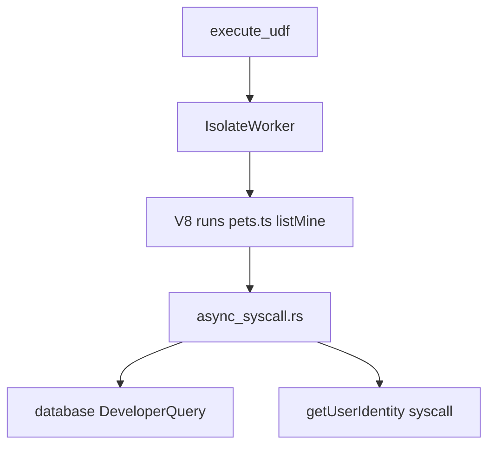

# isolate

**V8 sandbox** — runs user JavaScript (your Convex functions). Handles module loading, syscalls back to Rust (`ctx.db`, `ctx.auth`), and worker pool scheduling.

Primary target for [V8 inspector](/goals/v8-inspector) work.

## Role in query flow

## Key files

| File | Role |
|------|------|
| <CrateRef crate="isolate" file="client.rs" path="crates/isolate/src/client.rs" line="463" /> | `initialize_v8` — platform, CLI flags (`--js-base-64` 👀) |
| <CrateRef crate="isolate" file="client.rs" path="crates/isolate/src/client.rs" line="550" /> | `IsolateClient::new` — scheduler + workers |
| <CrateRef crate="isolate" file="client.rs" path="crates/isolate/src/client.rs" line="631" /> | `execute_udf` — main entry for query/mutation runs |
| <CrateRef crate="isolate" file="client.rs" path="crates/isolate/src/client.rs" line="1449" /> | `IsolateWorker::service_requests` — worker loop |
| <CrateRef crate="isolate" file="async_syscall.rs" path="crates/isolate/src/environment/udf/async_syscall.rs" line="802" /> | Syscall dispatch — `queryPage`, `getUserIdentity` |
| <CrateRef crate="isolate" file="analyze.rs" path="crates/isolate/src/environment/analyze.rs" /> | Static module analysis at deploy |

## Notes

### V8 init {#v8-init}

<CrateRef crate="isolate" file="client.rs" path="crates/isolate/src/client.rs" line="463" /> — sets up rusty_v8 platform. Flags include `--js-base-64` (inspector URL related?).

See [isolate client notes](/execution/isolate-client) for startup stepping.

### `execute_udf()` {#execute-udf}

<CrateRef crate="isolate" file="client.rs" path="crates/isolate/src/client.rs" line="631" /> — loads module, runs handler, collects `FunctionOutcome`.

For `pets.listMine`: runs handler that calls `optionalUser`, then `ctx.db.query('pets').withIndex('by_owner', ...)`.

### Syscalls {#syscalls}

JS `ctx.db.*` and `ctx.auth` become async syscalls in <CrateRef crate="isolate" file="async_syscall.rs" path="crates/isolate/src/environment/udf/async_syscall.rs" />:

| JS | Syscall | Rust |
|----|---------|------|
| `getAuthUserId` / identity | `1.0/getUserIdentity` | Reads `Transaction::user_identity()` |
| `db.query(...).collect()` | `1.0/queryPage` | [DeveloperQuery](/crates/database#developer-query) |

### Workers {#workers}

<CrateRef crate="isolate" file="client.rs" path="crates/isolate/src/client.rs" line="1449" /> — async worker loop. Good re-entry point after startup debugging.

## Debug tips

- Break `execute_udf` for every function run
- Break `queryPage` syscall handler to see index scans on `pets/by_owner`
- Break `getUserIdentity` to trace auth → JS

## Related

- [function_runner](/crates/function_runner)
- [database](/crates/database)
- [UDF execution](/flows/udf-execution)
- [V8 inspector goal](/goals/v8-inspector)
