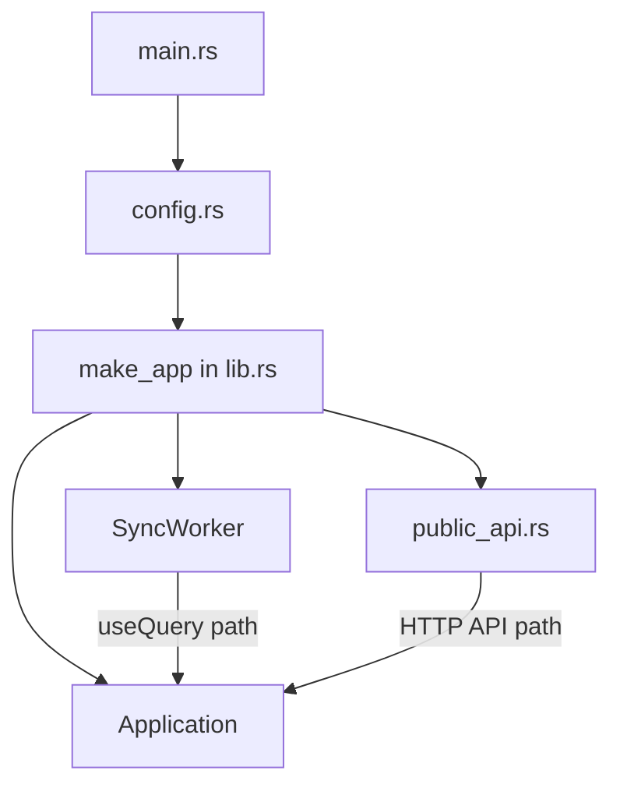

# local_backend

The **dev server binary** (`convex-local-backend`). Wires up config, database, Application, sync worker, and HTTP routes. Start here for startup debugging; use [public_api](/crates/local_backend#public-api) for the HTTP query path (vs WebSocket via sync).

## Role in query flow

For `pets.listMine` via `useQuery`, traffic goes **sync → application**, not public_api directly.

## Key files

| File | Role |
|------|------|
| <CrateRef crate="local_backend" file="main.rs" path="crates/local_backend/src/main.rs" line="1" /> | Entrypoint — tracing, Tokio init, `run_server` |
| <CrateRef crate="local_backend" file="lib.rs" path="crates/local_backend/src/lib.rs" /> | `run_server`, `make_app` — creates Application + workers |
| <CrateRef crate="local_backend" file="config.rs" path="crates/local_backend/src/config.rs" /> | Ports 3210/3211, SQLite path, instance secrets |
| <CrateRef crate="local_backend" file="public_api.rs" path="crates/local_backend/src/public_api.rs" line="418" /> | HTTP `execute_public_query` (alternative to sync) |

## Notes

### Startup {#startup}

See [entrypoint walkthrough](/startup/entrypoint) and [make_app()](/startup/make-app).

<CrateRef crate="local_backend" file="lib.rs" path="crates/local_backend/src/lib.rs" /> `make_app()` instantiates database, file storage, function_runner, and `Application<ProdRuntime>`.

### public_api {#public-api}

<CrateRef crate="local_backend" file="public_api.rs" path="crates/local_backend/src/public_api.rs" line="418" /> — HTTP path to the same `execute_public_query` sync uses. Useful if testing queries without WebSocket.

## Debug tips

- Break on `make_app()` to see the full wiring graph
- `pkill convex-local-backend` if debugger leaves zombie (see [debugger quirks](/dev/debugger-quirks))
- Port **3210** = daemon, **3211** = HTTP actions site proxy

## Related

- [sync](/crates/sync) — WebSocket path for `useQuery`
- [application](/crates/application)
- [Config](/startup/config)
