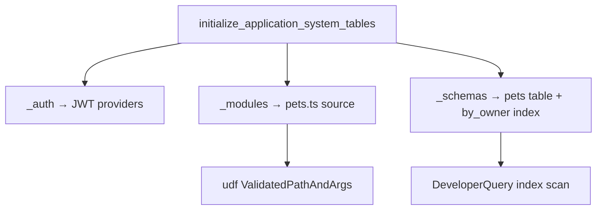

# model

**System metadata tables** — `_auth`, `_modules`, `_schemas`, `_functions`, etc. Backend reads these; user UDFs cannot mutate them via normal `ctx.db`.

Defines the schema that [database](/crates/database) uses for index scans.

## Role in query flow

## Key files

| File | Role |
|------|------|
| <CrateRef crate="model" file="lib.rs" path="crates/model/src/lib.rs" line="384" /> | `initialize_application_system_tables` — bootstraps system tables |
| <CrateRef crate="model" file="mod.rs" path="crates/model/src/auth/mod.rs" line="50" /> | `AuthInfoModel` — OIDC/JWT provider config in `_auth` |
| <CrateRef crate="model" file="mod.rs" path="crates/model/src/modules/mod.rs" line="270" /> | `ModuleModel::get_metadata` — resolves `pets.ts` for `pets:listMine` |
| <CrateRef crate="model" file="mod.rs" path="crates/model/src/modules/mod.rs" line="248" /> | `get_metadata_for_function` — export lookup |

## Notes

### At startup {#startup}

<CrateRef crate="model" file="lib.rs" path="crates/model/src/lib.rs" line="384" /> — called from `make_app()` when database initializes. Creates `_db`, `_auth`, `_functions`, `_modules`, `_schemas`, etc.

Stored in `convex_local_data.sqlite3` for local dev.

### `_auth` {#auth-table}

<CrateRef crate="model" file="mod.rs" path="crates/model/src/auth/mod.rs" line="50" /> — `AuthInfoModel::get()` returns provider config for [authentication](/crates/authentication).

### `_modules` {#modules-table}

<CrateRef crate="model" file="mod.rs" path="crates/model/src/modules/mod.rs" line="270" /> — stores deployed JS source. [isolate](/crates/isolate) module loader reads `pets.ts` from here.

### `_schemas` {#schemas-table}

Defines `pets` table fields and `by_owner` index. [database](/crates/database) `DeveloperQuery` uses this to plan index scans for `listMine`.

### Validation {#validation}

[udf](/crates/udf) `ValidatedPathAndArgs::new` uses `ModuleModel` to confirm `pets:listMine` exists, is public, and accepts `{}`.

## Debug tips

- Inspect `_modules` row for `pets.ts` if UDF not found errors
- Inspect `_schemas` if index `by_owner` misbehaves
- System tables use `_` prefix — see [value](/crates/value) `TableName`

## Related

- [database](/crates/database)
- [authentication](/crates/authentication)
- [udf](/crates/udf)
