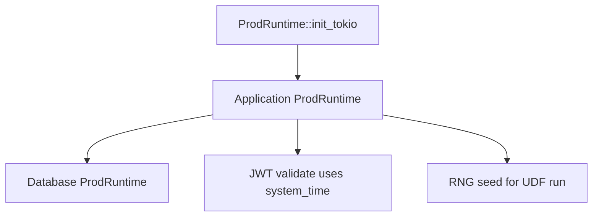

# runtime

**Production async runtime** — `ProdRuntime` implements the `Runtime` trait from [common](/crates/common). Abstracts Tokio, clocks, RNG, and thread spawning for Database, Application, and isolate.

## Role in query flow

Mostly invisible during tracing — until timestamps or async behavior surprise you.

## Key files

| File | Role |
|------|------|
| <CrateRef crate="runtime" file="prod.rs" path="crates/runtime/src/prod.rs" line="146" /> | `ProdRuntime` struct |
| <CrateRef crate="runtime" file="prod.rs" path="crates/runtime/src/prod.rs" line="151" /> | `init_tokio` — called from local_backend startup |
| <CrateRef crate="common" file="mod.rs" path="crates/common/src/runtime/mod.rs" line="280" /> | `Runtime` trait — `Database<RT>`, `Transaction<RT>`, etc. |

## Notes

### `ProdRuntime` {#prod-runtime}

<CrateRef crate="runtime" file="prod.rs" path="crates/runtime/src/prod.rs" line="146" /> — the concrete `RT` type parameter on `Application<ProdRuntime>`, `Database<ProdRuntime>`, etc.

Created once at startup in [local_backend](/crates/local_backend).

### What it provides {#provides}

| Method | Used for |
|--------|----------|
| `system_time()` | JWT expiry validation in [authentication](/crates/authentication) |
| `unix_timestamp()` | `_creationTime` on writes, Date-like behavior |
| `rng()` | UDF randomness seed at start of run |
| `spawn` / thread pool | V8 worker threads in [isolate](/crates/isolate) |

### Generic `RT` pattern {#generic-rt}

Most core types are `Foo<RT: Runtime>` — enables test runtimes without Tokio. When debugging locally, it's always `ProdRuntime`.

## Debug tips

- Usually not the first place to break — follow the query flow crates first
- Timestamp bugs (JWT expired, wrong query ts) → check `system_time` / `generate_timestamp`
- See [startup entrypoint](/startup/entrypoint) for Tokio init sequence

## Related

- [local_backend](/crates/local_backend)
- [common](/crates/common)
- [database](/crates/database)
