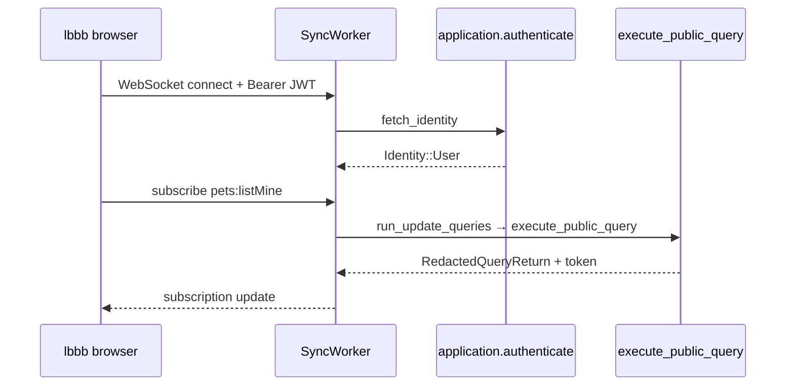

# sync

**Client/server sync protocol.** Handles WebSocket connections from Convex clients (`useQuery`, `useMutation`). Owns subscription state and re-runs queries when data changes.

This is the path `pets.listMine` takes from the lbbb React app.

## Role in query flow

## Key files

| File | Role |
|------|------|
| <CrateRef crate="sync" file="worker.rs" path="crates/sync/src/worker.rs" /> | SyncWorker — identity fetch, query refresh, subscription push |
| <CrateRef crate="sync" file="lib.rs" path="crates/sync/src/lib.rs" /> | Public exports — `SyncWorker`, `SyncWorkerConfig` |
| <CrateRef crate="sync" file="state.rs" path="crates/sync/src/state.rs" /> | Per-connection subscription state |

## Notes

### `fetch_identity()` {#fetch-identity}

<CrateRef crate="sync" file="worker.rs" path="crates/sync/src/worker.rs" line="786" /> — on WebSocket connect, extracts Bearer token and calls `Application::authenticate`. Result becomes the identity passed to every query on that connection.

### `run_update_queries()` {#run-update-queries}

<CrateRef crate="sync" file="worker.rs" path="crates/sync/src/worker.rs" line="940" /> — when a subscription needs refresh (initial load or invalidation), loops calling:

<CrateRef crate="sync" file="worker.rs" path="crates/sync/src/worker.rs" line="999" /> `execute_public_query` with `ExportPath` like `pets:listMine`.

Retries with backoff on transient failures.

### Reactive invalidation

Sync stores the **read token** from each query result. When database writes touch documents in that token's `ReadSet`, sync re-runs the query. See [database](/crates/database#readset-token).

## Debug tips

- Break at line 999 to catch every subscription query refresh
- Confirm `query.udf_path` canonicalizes to `pets:listMine`
- Compare with HTTP path via [local_backend public_api](/crates/local_backend#public-api)

## Related

- [application](/crates/application)
- [authentication](/crates/authentication)
- [pets.listMine trace](/today/list-mine)
