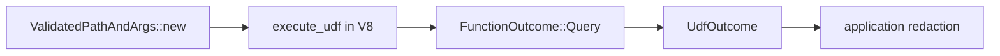

# udf

**UDF outcome types and validation** — Rust-side representation of a completed query/mutation/action, plus pre-execution checks before V8 runs.

## Role in query flow

## Key files

| File | Role |
|------|------|
| <CrateRef crate="udf" file="validation.rs" path="crates/udf/src/validation.rs" line="394" /> | `ValidatedPathAndArgs` — path/args/visibility checks |
| <CrateRef crate="udf" file="udf_outcome.rs" path="crates/udf/src/udf_outcome.rs" line="43" /> | `UdfOutcome` — result, journal, identity, log lines |
| <CrateRef crate="udf" file="function_outcome.rs" path="crates/udf/src/function_outcome.rs" /> | `FunctionOutcome::Query` wrapper from isolate |

## Notes

### Validation {#validation}

<CrateRef crate="udf" file="validation.rs" path="crates/udf/src/validation.rs" line="394" /> `ValidatedPathAndArgs::new` — before V8 runs:

- Path `pets:listMine` exists in [model](/crates/model) `_modules`
- Export is a public query
- Args `{}` match validator

Failure → `JsError` returned without starting V8.

### `UdfOutcome` {#udf-outcome}

<CrateRef crate="udf" file="udf_outcome.rs" path="crates/udf/src/udf_outcome.rs" line="43" /> — after handler returns:

- `result: JsonPackedValue` — serialized pet list ([value](/crates/value))
- `journal` — incremental query state for paginated subscriptions
- `observed_identity` — whether handler called `getUserIdentity`
- log lines → [redaction](/crates/application#redaction)

### `FunctionOutcome` {#function-outcome}

<CrateRef crate="udf" file="function_outcome.rs" path="crates/udf/src/function_outcome.rs" /> — enum wrapping query/mutation/action outcomes. `execute_udf` returns `FunctionOutcome::Query(UdfOutcome)`.

## Debug tips

- Validation failures happen *before* isolate — good first check for "function not found"
- Inspect `UdfOutcome.result` after run to see serialized return value
- `observed_identity: false` explains empty auth in handler

## Related

- [function_runner](/crates/function_runner)
- [isolate](/crates/isolate)
- [application](/crates/application)
