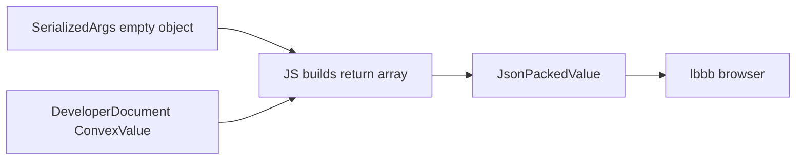

# value

**Convex value system** — runtime types for documents, IDs, table names, and wire-format serialization.

Everything in `ctx.db` and UDF return values flows through here.

## Role in query flow

## Key files

| File | Role |
|------|------|
| <CrateRef crate="value" file="lib.rs" path="crates/value/src/lib.rs" line="123" /> | `ConvexValue` enum — all runtime values |
| <CrateRef crate="value" file="object.rs" path="crates/value/src/object.rs" /> | `ConvexObject` — pet documents, return objects |
| <CrateRef crate="value" file="document_id.rs" path="crates/value/src/document_id.rs" /> | `DeveloperDocumentId` — `ownerUserId`, pet `_id` |
| <CrateRef crate="value" file="table_name.rs" path="crates/value/src/table_name.rs" /> | `TableName` — `"pets"` vs `_auth` system prefix |
| <CrateRef crate="value" file="json_packed_value.rs" path="crates/value/src/json/json_packed_value.rs" line="15" /> | `JsonPackedValue` — compact JSON on the wire |

## Notes

### Args {#args}

`pets.listMine` takes `{}` — arrives as `SerializedArgs`, deserialized to empty object for V8.

### Documents {#documents}

<CrateRef crate="value" file="lib.rs" path="crates/value/src/lib.rs" line="123" /> — each row from `DeveloperQuery` is a `ConvexValue` (usually object).

`ownerUserId` is a `DeveloperDocumentId` pointing at `users` table.

### Table names {#table-names}

<CrateRef crate="value" file="table_name.rs" path="crates/value/src/table_name.rs" /> — `"pets"` is a user table; `_auth`, `_modules` use metadata prefix.

### Wire format {#wire-format}

<CrateRef crate="value" file="json_packed_value.rs" path="crates/value/src/json/json_packed_value.rs" line="15" /> — final query result packed for sync → WebSocket → Convex client → React.

Also used in [sync](/crates/sync) `ServerMessage` type alias.

## Debug tips

- Inspect `JsonPackedValue` after query to see exact client payload
- ID encoding bugs show up as `DeveloperDocumentId::decode` failures
- Compare with lbbb TypeScript types in `convex/_generated/dataModel.d.ts`

## Related

- [database](/crates/database)
- [udf](/crates/udf)
- [common](/crates/common)
