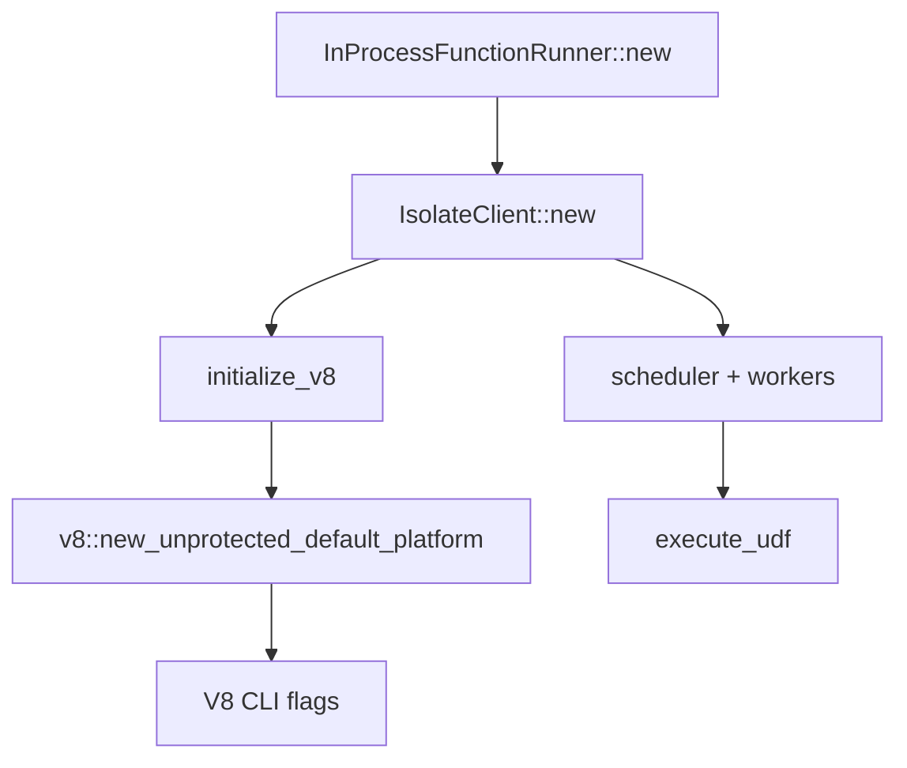

# Isolate client

The isolate is Convex's V8 sandbox runner / cloud worker. Created inside `InProcessFunctionRunner::new()`.

## IsolateClient::new()

<CodeLink file="crates/isolate/src/client.rs" line="550">IsolateClient::new()</CodeLink>

### initialize_v8()

<CodeLink file="crates/isolate/src/client.rs" line="463">initialize_v8()</CodeLink>

1. Sets up some unicode stuff
2. `v8::new_unprotected_default_platform()`
   - Config: thread pool size, idle fns behavior, etc.
   - From [rusty_v8](https://github.com/denoland/rusty_v8) (Deno's V8 bindings)
3. Passes command-line flags to V8:
   - `--no-wasm-async-compilation` (due to WASM crash — lots of these bugs are now fixed)
   - `--disallow-code-generation-from-strings` (no `eval()` etc.)
   - `--stack-size=2048`
   - `--js-base-64` (Hmmm... used for inspector URLs. Someone already tried?)

### Back to IsolateClient

- Creates a scheduler and workers

## Key methods in client.rs

- <CodeLink file="crates/isolate/src/client.rs" line="631">execute_udf()</CodeLink>
- `execute_action()`
- `execute_http_action()`

HTTP actions note:

```rust
/// HTTP actions can run other UDFs, so they take in a ActionCallbacks from
/// the application layer. This creates a transient reference cycle.
```

## V8 init → execution



## Related

- [Function runner](/execution/function-runner)
- [UDF execution](/flows/udf-execution)
- [V8 inspector goal](/goals/v8-inspector)
