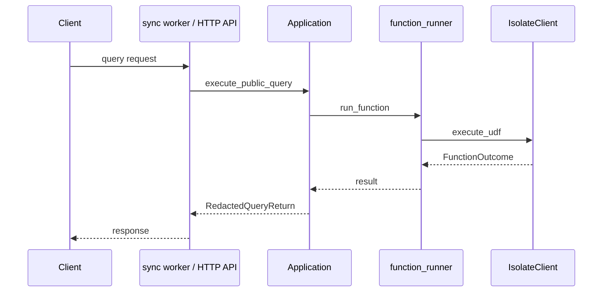

# Query entry

Most traffic goes through `execute_public_query` — the main entry point for queries, used by the sync worker and HTTP API.

## Signature

From <CrateRef crate="application" file="api.rs" path="crates/application/src/api.rs" line="98" />:

```rust
/// Execute a public query on the root app. This method is used by the sync
/// worker and HTTP API for the majority of traffic as the main entry point
/// for queries.
async fn execute_public_query(
    &self,
    host: &ResolvedHostname,
    request_context: RequestContext,
    identity: Identity,
    path: ExportPath,
    args: SerializedArgs,
    caller: FunctionCaller,
    ts: ExecuteQueryTimestamp,
    journal: Option<SerializedQueryJournal>,
) -> anyhow::Result<RedactedQueryReturn>;
```

## Callers

- <CrateRef crate="sync" file="worker.rs" path="crates/sync/src/worker.rs" line="999" /> — WebSocket subscription traffic
- <CrateRef crate="local_backend" file="public_api.rs" path="crates/local_backend/src/public_api.rs" line="418" /> — HTTP API

## Query flow (high level)



## Related

- [UDF execution](/flows/udf-execution)
- [Function runner](/execution/function-runner)
