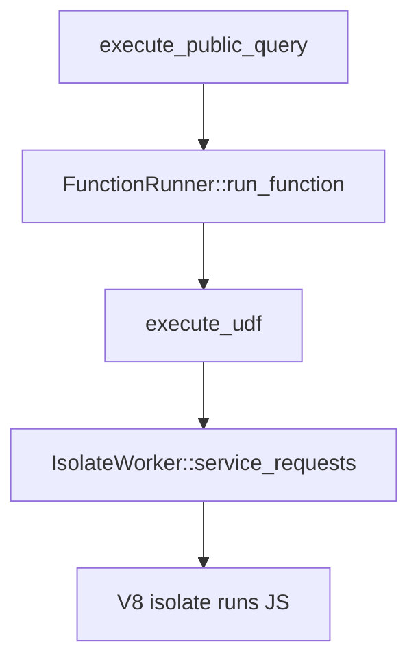

# UDF execution

After stepping through all the setup of the Action and function_runner envs, the rest is highly async. Need a higher-level debugger and maybe instrument the UDF runner.

## Entry points

- <CrateRef crate="isolate" file="client.rs" path="crates/isolate/src/client.rs" line="631" /> `execute_udf()` — main UDF execution
- <CrateRef crate="isolate" file="client.rs" path="crates/isolate/src/client.rs" line="1449" /> `IsolateWorker::service_requests` — worker loop servicing requests

## UDF execution flow

## HTTP actions path

`execute_http_action()` can run other UDFs — takes `ActionCallbacks` from the application layer, creating a transient reference cycle.

See note in <CrateRef crate="isolate" file="client.rs" path="crates/isolate/src/client.rs" />.

## Breakpoint strategy

Good async re-entry points:

1. `execute_udf` — <CrateRef crate="isolate" file="client.rs" path="crates/isolate/src/client.rs" line="631" /> when a function actually runs
2. `IsolateWorker::service_requests` — <CrateRef crate="isolate" file="client.rs" path="crates/isolate/src/client.rs" line="1449" /> worker picking up work
3. `FunctionRunner::run_function` — <CrateRef crate="function_runner" file="lib.rs" path="crates/function_runner/src/lib.rs" line="85" /> application layer dispatch

See [Debugger quirks](/dev/debugger-quirks) for cleanup when async breakpoints go wrong.

## Related

- [Query entry](/flows/query-entry)
- [Isolate client](/execution/isolate-client)
- [V8 inspector goal](/goals/v8-inspector)
