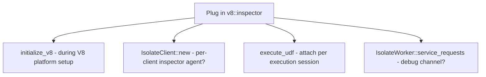

# V8 inspector

**Goal:** figure out where to plug in `deno_core::v8::inspector` (a Rust implementation of the Javascript inspector protocol).

## Why function_runner / IsolateClient

Likely candidates are somewhere that hooks into function_runner or thereabouts. function_runner creates the V8 engine so it feels right.

## Clues already in the codebase

In <CrateRef crate="isolate" file="client.rs" path="crates/isolate/src/client.rs" line="463" /> `initialize_v8()`, one of the V8 flags is:

```
--js-base-64
```

Comment in notes: "Hmmm... used for inspector URLs. Someone already tried?"

Worth searching for existing inspector-related code:

- `inspector` in crates/isolate
- `deno_core::v8::inspector`
- Chrome DevTools Protocol references

## Candidate hook points



| Location | Rationale |
|----------|-----------|
| `initialize_v8()` | <CrateRef crate="isolate" file="client.rs" path="crates/isolate/src/client.rs" line="463" /> — one-time V8 platform setup; inspector needs platform |
| `IsolateClient::new()` | <CrateRef crate="isolate" file="client.rs" path="crates/isolate/src/client.rs" line="550" /> — create inspector agent alongside scheduler/workers |
| `execute_udf()` | <CrateRef crate="isolate" file="client.rs" path="crates/isolate/src/client.rs" line="631" /> — per-execution debug session (most useful for stepping JS) |
| `IsolateWorker::service_requests` | <CrateRef crate="isolate" file="client.rs" path="crates/isolate/src/client.rs" line="1449" /> — worker-level debug channel |

## Next steps

1. Search codebase for existing inspector attempts
2. Read Deno/rusty_v8 inspector examples
3. Set breakpoint at `execute_udf` and trace what context is available
4. Determine if inspector attaches per-isolate or per-context

## Related

- [Isolate client](/execution/isolate-client)
- [Function runner](/execution/function-runner)
- [UDF execution](/flows/udf-execution)
- [Debugger quirks](/dev/debugger-quirks)
