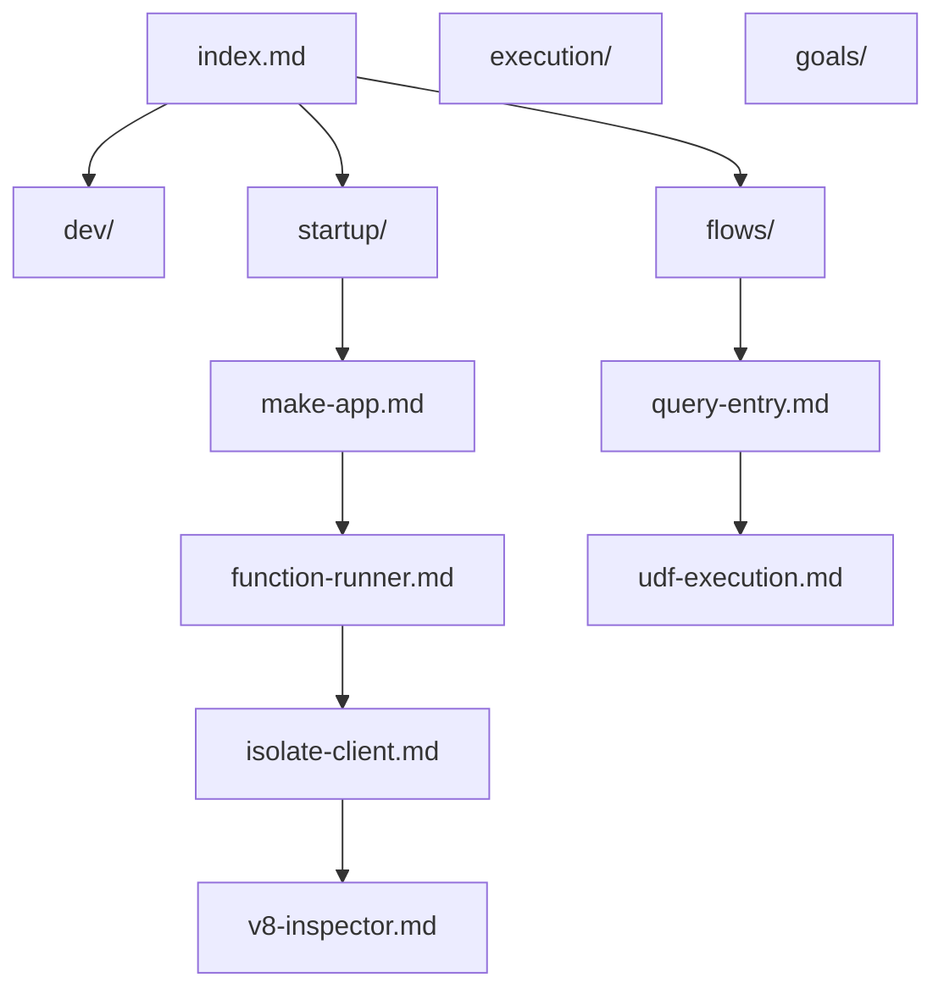

# Convex Backend Exploration

Dear diary, for my first open source contribution I've decided on a massive thing that I will never finish. Sleep well.

## Where I am now

Stepped through startup through `make_app()` and `InProcessFunctionRunner` / `IsolateClient` creation. Next: higher-level async debugging around UDF execution and figuring out where to plug in `deno_core::v8::inspector`.

See [V8 inspector goal](/goals/v8-inspector) for the north star.

## Quick reference

| What | Value |
|------|-------|
| Backend port | `3210` |
| HTTP actions port | `3211` |
| Local dashboard | [http://localhost:6790](http://localhost:6790) |
| Local backend URL | `http://localhost:3210/` |
| Admin key (local dev) | `0135d8598650f8f5cb0f30c34ec2e2bb62793bc28717c8eb6fb577996d50be5f4281b59181095065c5d0f86a2c31ddbe9b597ec62b47ded69782cd` |
| Run backend | `just run-local-backend` |
| Run dashboard | `just run-dashboard http://localhost:3210/` |
| Run notes site | `just notes` → [http://localhost:5173](http://localhost:5173) |
| Kill stuck backend | `pkill convex-local-backend` |

## Code links

Click any underlined symbol to open the file in Cursor/VS Code.

Example: <CodeLink file="crates/local_backend/src/main.rs" line="1">main.rs entrypoint</CodeLink>

## Map of notes

