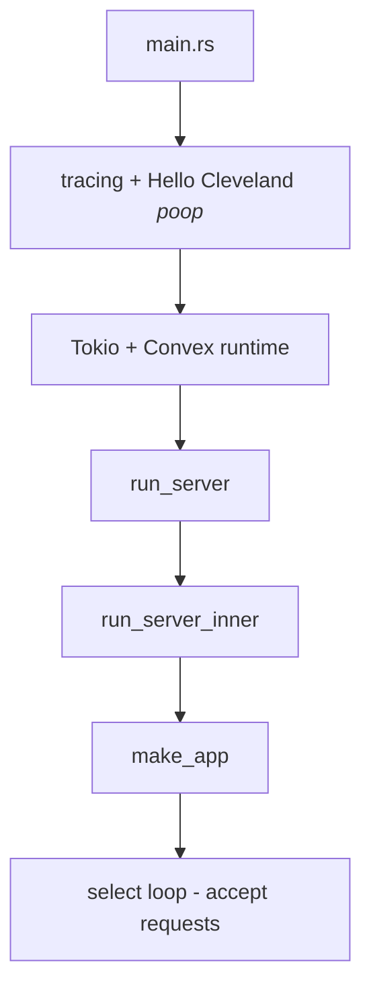

# Entrypoint

Found entrypoint at <CrateRef crate="local_backend" file="main.rs" path="crates/local_backend/src/main.rs" line="1" /> `main()`.

## Stepping trace

Stepping `main()`:

1. Loads config — looks good so far
2. Sets up tracing and does their "Hello Cleveland"
3. Initializes Tokio and Convex runtime
   - Tokio — multithread async network lib
   - Runtime sits on port 3210
4. Calls server main and waits
   - `run_server()` calls `select`
5. Eventually goes through gobbledygook and gets to `run_server_inner()`
6. `make_app()` starts everything up — see [make_app()](/startup/make-app)
7. Back at the outer `select` of `run_server`, ready to accept requests

## Startup flow

## Open questions

- Looks like maybe 4 Applications/Servers are created? Or maybe just async stuff hitting those breakpoints a lot.

## Related

- [make_app() walkthrough](/startup/make-app)
- [Config deep dive](/startup/config)
