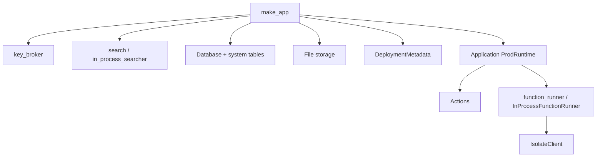

# make_app()

`make_app()` is where the heavy lifting happens during startup. Creates the database, storage, function runner, and wires up `Application<ProdRuntime>`.

## What gets created

### key_broker()

Instantiated first. Config details in [Config](/startup/config) — lots of interesting stuff in <CrateRef crate="local_backend" file="config.rs" path="crates/local_backend/src/config.rs" />.

### Search

Sets up searcher / `in_process_searcher` for search indexing — <CrateRef crate="search" file="lib.rs" path="crates/search/src/lib.rs" />.

### Database

- Has a quota/rate limiter thingy
- `initialize_application_system_tables()` — `_db`, `_auth`, `_functions`, `_scheduled_jobs`, `_modules`, `_tables`, `_indexes`, etc.
- All in `convex_local_data.sqlite3` presumably?

### File storage

- `convex_local_storage/files`, `/modules`, `/search`, etc.

### DeploymentMetadata

- name / region
- deployment class (paid/premium presumably?)

### Application wiring

End of this creates `Application<ProdRuntime>` seeded with everything above:

- `node_process_timeout(5 seconds)` — global or just for the next call?
- `node_executor(takes timeout thing)`
- creates `Actions(takes node exec/timeout)` — is this the thing that actually runs stuff?
- creates `fetch_client`, `oidc_http_client`
- **function_runner** — one of the biggies! See [Function runner](/execution/function-runner)
- Now instantiate `Application` with all the doodads (db, filestore, function_runner, search/indexer)

## make_app dependency graph

## Related

- [Config](/startup/config)
- [Function runner](/execution/function-runner)
- [Isolate client](/execution/isolate-client)
