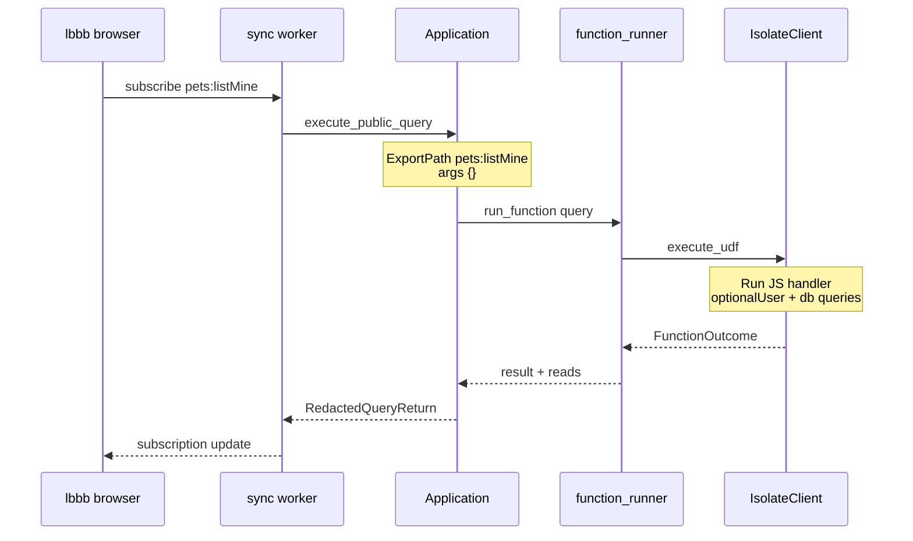

# pets.listMine

The simplest read path in lbbb: show the signed-in user's pets on `/app/pets/`.

## Client

<CodeLink repo="lbbb" file="src/routes/app/pets/index.tsx" line="14">src/routes/app/pets/index.tsx</CodeLink>:

```tsx
const rows = useQuery(api.pets.listMine)
```

Also used on the app home page: <CodeLink repo="lbbb" file="src/routes/app/index.tsx" line="14">src/routes/app/index.tsx</CodeLink>.

`useQuery` opens a **WebSocket subscription** to the backend. On connect (and on invalidation), the sync worker runs the query and pushes results to the client. Not a one-shot HTTP fetch.

## Convex function

<CodeLink repo="lbbb" file="convex/pets.ts" line="65">pets.listMine</CodeLink> — public query, no args:

```typescript
export const listMine = query({
  args: {},
  handler: async (ctx) => {
    const user = await optionalUser(ctx)
    if (!user) return []

    const pets = await ctx.db
      .query('pets')
      .withIndex('by_owner', (q) => q.eq('ownerUserId', user._id))
      .collect()
    // ... enriches each pet with blog, avatar, post/image counts
  },
})
```

### Auth

Uses <CodeLink repo="lbbb" file="convex/lib/requireUser.ts" line="8">`optionalUser`</CodeLink> → `getAuthUserId(ctx)` from `@convex-dev/auth`. Returns `[]` if not signed in (no error).

### DB reads

| Step | Table | Index |
|------|-------|-------|
| 1 | `pets` | `by_owner` on `ownerUserId` |
| 2 | `petBlogs` | `by_pet` per pet |
| 3 | `generatedPosts` | `by_pet` per pet |
| 4 | `assets` | `by_pet` per pet |

Schema: <CodeLink repo="lbbb" file="convex/schema.ts" line="90">`pets` table</CodeLink> with `.index('by_owner', ['ownerUserId'])`.

Filters out soft-deleted pets (`deletedAt === undefined`).

### Return shape

Array of `{ pet, blog, avatarUrl, postCount, imageCount, latestPost }` — a page-level read model, not just raw pet docs.

## Backend path (convex-backend)



### Key backend touchpoints

1. **Sync worker** — <CodeLink file="crates/sync/src/worker.rs" line="999">calls `execute_public_query`</CodeLink> when a subscription needs refresh
2. **Query entry** — <CodeLink file="crates/application/src/api.rs" line="98">`execute_public_query`</CodeLink>
3. **UDF execution** — <CodeLink file="crates/isolate/src/client.rs" line="631">`execute_udf`</CodeLink>
4. **Worker loop** — <CodeLink file="crates/isolate/src/client.rs" line="1449">`IsolateWorker::service_requests`</CodeLink>

UDF path the backend sees: `pets:listMine` (module `pets`, export `listMine`).

## Debugger plan

1. Run lbbb against local backend (`just run-local-backend` + point lbbb at `http://127.0.0.1:3210`)
2. Open `/app/pets/` in browser while signed in
3. Break on `execute_public_query` — confirm path is `pets:listMine`
4. Break on `execute_udf` — step into V8 execution
5. Note which system tables / indexes get touched

## Code Flow

<CrateRef crate="sync" file="worker.rs" path="crates/sync/src/worker.rs" line="999" /> `run_update_queries()` gets a request — sync crate seems to handle a lot of the client/server interface. Goes to 
<CrateRef crate="application" file="api.rs" path="crates/application/src/api.rs" line="98" /> `execute_public_query()` which is thin and calls
<CrateRef crate="application" file="lib.rs" path="crates/application/src/lib.rs" line="1103" /> `read_only_udf_at_ts()`. Lots of interesting stuff in `lib.rs`

> <CrateRef crate="poopy" file="redaction.rs" path="crates/application/src/lib.rs" line="1103" /> redacts log lines the client shouldn't see. Shouldn't just for cleanliness or is there tasty shit in there?

#### Random
<CrateRef crate="application" file="redaction.rs" path="crates/application/src/lib.rs" line="1103" /> redacts log lines the client shouldn't see. Shouldn't just for cleanliness or is there tasty shit in there?

## Open questions

- How does auth identity from the JWT get passed into the isolate as `ctx.auth`?
- Does the sync worker cache/reuse query results, or re-run the full handler on every invalidation?
- N+1 pattern: `listMine` does 3 extra queries per pet — fine for now but worth noting

## Related

- [Today's overview](/today/)
- [Query entry](/flows/query-entry)
- [UDF execution](/flows/udf-execution)
